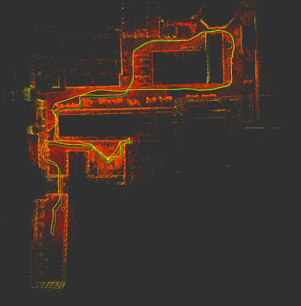

# LIO-SLAM: LiDAR-IMU Odometry and Mapping in ROS 2

<p align="center">
  
</p>
<p align="center">
  <i>Example point cloud map generated by the system. Yellow: trajectory without loop closure, Green: optimized trajectory after loop closure, Red points: generated map.</i>
</p>

---

This package provides a LiDAR-IMU based SLAM system for ROS 2 Humble. It integrates concepts from [lidarslam_ros2](https://github.com/rsasaki0109/lidarslam_ros2) and the IMU processing approach from [LIO-SAM](https://github.com/TixiaoShan/LIO-SAM), adapted from the [li_slam_ros2](https://github.com/rsasaki0109/li_slam_ros2) repository.

## Prerequisites

* **Ubuntu 22.04:** This is the version the package was tested on.
* **ROS 2 Humble:** Ensure you have `colcon` and other standard build tools installed ([Installation Guide](https://docs.ros.org/en/humble/Installation/Ubuntu-Install-Debs.html)).
* **GTSAM Library:**
    ```bash
    sudo add-apt-repository ppa:borglab/gtsam-release-4.1
    sudo apt update
    sudo apt install -y libgtsam-dev libgtsam-unstable-dev
    ```
* **Eigen & PCL:** These are typically installed automatically during build (see below).

## Build Instructions

1.  **Create a ROS 2 Workspace:**
    ```bash
    mkdir -p ~/lio_ws/src
    cd ~/lio_ws
    ```

2.  **Download the Package:**
    * Download the `lio-slam` folder (e.g., using the "Code" -> "Download ZIP" button on GitHub, then extracting).
    * Move or copy the downloaded `lio-slam` folder **into** the `~/lio_ws/src` directory. Your structure should be `~/lio_ws/src/lio-slam`
  

3.  **Install Dependencies:** Navigate to the root of your workspace and use `rosdep` to install dependencies listed in the package manifests (`package.xml`).
    ```bash
    cd ~/lio_ws 
    sudo apt install python3-rosdep2 # Run this only for get an error that rosdep is missing
    sudo rosdep init
    rosdep update
    rosdep install --from-paths src --ignore-src -y --rosdistro humble
    ```
    *(This command should pull in dependencies like PCL, Eigen, etc.)*

4.  **Build the Package:** Build your workspace using `colcon`.
    ```bash
    cd ~/lio_ws
    colcon build --symlink-install --cmake-args -DCMAKE_BUILD_TYPE=Release
    ```

## Running the Demo

1.  **Download Example Data (ROS 2 bag):**
    * Download an example ROS 2 bag file (e.g., `walking_dataset.zip`) from: [Google Drive Folder](https://drive.google.com/drive/folders/1Nalumw9wydH-brCPeVHV-oUH5batDm2J?usp=sharing).
    * Unzip the downloaded file.
    * Place the resulting bag folder (e.g., `walking_dataset/`) inside your workspace (`~/lio_ws`) or note its path.

2.  **Run the System:** You'll need three separate terminals.

    * **Important:** In **each** new terminal, source your workspace's setup file first to make the built package available:
        ```bash
        cd ~/lio_ws 
        source install/setup.bash 
        ```

    * **Terminal 1 (Launch RViz):** Start RViz with the provided configuration.
        ```bash
        # Remember to source first!
        rviz2 -d src/lio-slam/scanmatcher/rviz/lio.rviz
        ```
    * **Terminal 2 (Launch SLAM Node):** Start the main SLAM processing node.
        ```bash
        # Remember to source first!
        ros2 launch scanmatcher lio.launch.py
        ```
    * **Terminal 3 (Play ROS Bag):** Play back the sensor data. Adjust the path if your bag is located elsewhere.
        ```bash
        # Remember to source first!
        ros2 bag play walking_dataset/ 
        ```

    You should see the map, LiDAR points, and robot trajectory being visualized in RViz.

## Using Other Datasets (e.g., LIO-SAM Datasets)

* You can try datasets from the original [LIO-SAM repository](https://github.com/TixiaoShan/LIO-SAM).
* **Note:** These datasets often require specific IMU parameters or calibration. You may need to adjust the `params.yaml` file within this package or potentially modify the code to match the sensor configuration of the dataset.
* **ROS 1 Bag Conversion:** LIO-SAM datasets are provided as ROS 1 bags. To use them with ROS 2, you need to convert them. The `rosbags` Python package is a useful tool for this:
    * Install: `pip install rosbags`
    * Refer to the [rosbags documentation](https://pypi.org/project/rosbags/) for conversion examples (often involving reading the ROS 1 bag and writing specific topics to a new ROS 2 bag).

## Core Libraries Used

This package relies on several great open-source libraries:

* **Eigen:** Linear algebra library.
* **PCL:** For point cloud processing. (BSD 3 License)
* **GTSAM:** Factor graph-based optimization. (BSD 2 License)
* **ndt_omp:** Multi-threaded NDT implementation. ([source](https://github.com/koide3/ndt_omp), BSD 2 License)
* **g2o:** Graph optimization framework. (BSD 2 License, check specific module licenses)

## References

This work is heavily based on and adapts code from:

* [li_slam_ros2](https://github.com/rsasaki0109/li_slam_ros2) by Ryodo Sasaki
* [lidarslam_ros2](https://github.com/rsasaki0109/lidarslam_ros2) by Ryodo Sasaki
* [LIO-SAM](https://github.com/TixiaoShan/LIO-SAM) by Tixiao Shan et al.

Please consider citing the original works if you use this package in your research.
