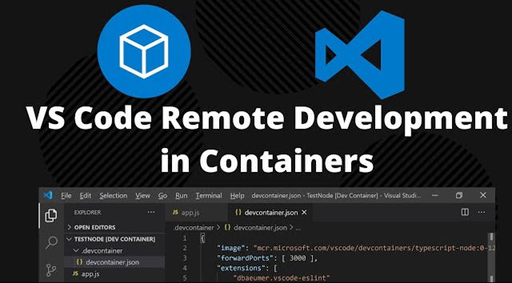

# Instructions for Setting Up a Dev Container



-	If on Windows: first install WSL2: https://learn.microsoft.com/en-us/windows/wsl/install 

### Docker
-	Download and install either Docker Engine or Docker Desktop
    -	Windows: Download and install Docker Desktop: https://docs.docker.com/desktop/install/windows-install/ 
    -	Linux: https://docs.docker.com/engine/install/ubuntu/ 
        -	Docker Engine (Terminal based; Prefered over Docker Desktop for Ubuntu)
-	(if using GPU, e.g., for deep learning) Download and install NVIDIA Container Toolkit 

### VS Code
-	Windows/Linux: Download and install VS Code: https://code.visualstudio.com/download
-	Go to VS Code extensions panel (CTRL+Shift+X) and install Dev Containers 
-	Install the "Remote Development" extension for Visual Studio Code
-	In VS Code, create a folder for your project, go to the folder, and then open the configuration screen (Ctrl+Shift+P) and type/select “Dev Containers: New Dev Container”
    -	Follow the steps and select appropriate configurations, e.g., select C++ project, CMake version 3.22, and Ubuntu 22.04

### OpenCV
For installing OpenCV within container:
-	Modify the Dockerfile in the .devcontainer by adding the commands from https://medium.com/@albertqueralto/installing-opencv-within-docker-containers-for-computer-vision-and-development-a93b46996520 
-	Note when you are building the image for the first time, it will take a long time (15 minutes)

### GUI display:
#### Linux:
-	A very important step before running the devcontainer in VS Code is to type in the terminal “xhost +”. This allows you to connect to the X11 display server so you can display any GUI windows.
-	Here's that code snippet to convince the X-server to forward on Linux (goes in devcontainer.json)
    ```
    "containerEnv": {
            "DISPLAY": "unix:0"
        },
        "mounts": [
            "source=/tmp/.X11-unix,target=/tmp/.X11-unix,type=bind,consistency=cached"
        ],
        "runArgs": ["--privileged"]
    ```
####  Windows:
-	Download the vcxsrv installer and run leaving everything at default: https://sourceforge.net/projects/vcxsrv/ 
-	Once installed, run XLaunch in Windows, leaving everything as default.
    -	NOTE: use “One large window” when starting XLaunch if your GUI is cropped
-	In .devcontainer>Dockerfile, add  
    ```
	ENV DISPLAY=host.docker.internal:0
    ```
    and then build the container
-	Everything should be set & working now!
