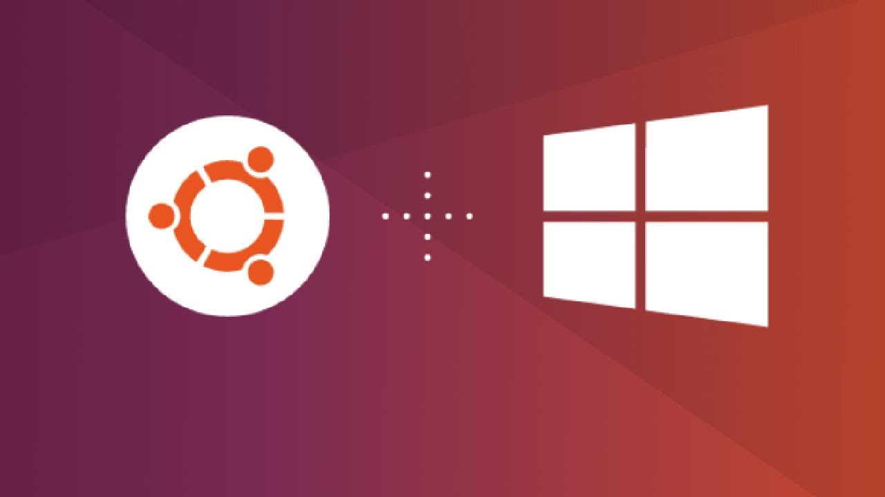
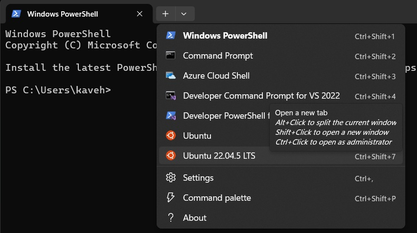
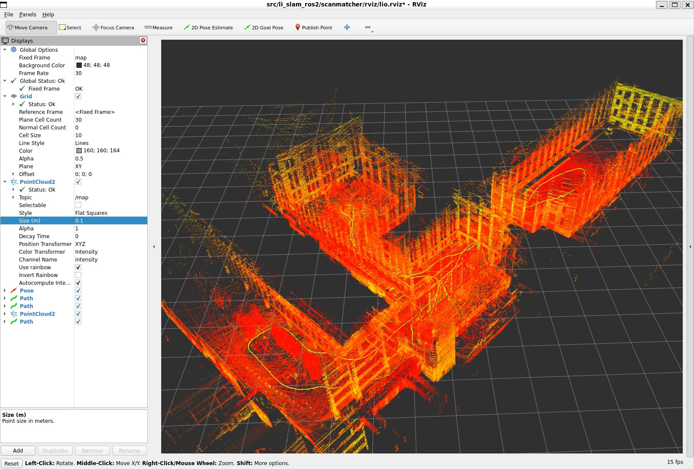

# Setting up Ubuntu and ROS 2 on Windows using WSL: A Tutorial with a LiDAR-SLAM Example



## Introduction

If you want to develop or learn ROS 2 on Ubuntu but only have a Windows machine, Windows Subsystem for Linux (WSL) provides an excellent solution. It allows you to run a genuine Linux environment, like Ubuntu, directly on Windows, tightly integrated with your system. This avoids the need for dual-booting, a separate Linux PC, or managing resource allocation in Docker.

This tutorial guides you through:

1.  Installing Ubuntu 22.04 using WSL on Windows
2.  Installing ROS 2 Humble
3.  Setting up and running a LiDAR-SLAM example in ROS 2

## WSL Setup

Follow these steps to get WSL and Ubuntu 22.04 running:

1.  **Install Windows Terminal (recommended):** While optional, Windows Terminal provides a modern, tabbed interface for accessing PowerShell, Command Prompt, and your WSL distributions. Install it from the Microsoft Store: [Windows Terminal](https://apps.microsoft.com/detail/9n0dx20hk701?hl=en-US&gl=US)
2.  **Enable WSL and Install Ubuntu 22.04:**
    * Open **PowerShell as Administrator**
    * Run `wsl --install -d Ubuntu-22.04`. This command enables necessary Windows features, installs the WSL kernel, and downloads/installs the Ubuntu 22.04 distribution
    * Follow the on-screen prompts, which will include creating a username and password for your Ubuntu environment
    * For detailed instructions or troubleshooting, refer to the official Microsoft guide: [Install WSL](https://learn.microsoft.com/en-us/windows/wsl/install)
3.  **Update WSL (optional but recommended):** Ensure you have the latest WSL version by running `wsl --update` in PowerShell.
4.  **Running Linux GUI Apps (like RViz):** Modern WSL versions support Linux GUI applications out-of-the-box. RViz (used in the ROS example) should work without extra setup.
    * If you encounter issues (e.g., graphical glitches, apps not launching), you might need to update Windows or install specific graphics drivers for WSL. See the Microsoft guide for troubleshooting: [Run Linux GUI apps](https://learn.microsoft.com/en-us/windows/wsl/tutorials/gui-apps).
5.  **Accessing Files:**
    * **From Windows to Ubuntu:** Open Windows File Explorer. You should see a "Linux" section in the navigation pane where you can access your Ubuntu file system.
    * **From Ubuntu to Windows:** Your Windows drives are typically mounted under `/mnt/`. For example, your C: drive is accessible at `/mnt/c/`.
    * **Quick Access:** To open the current Ubuntu directory in Windows File Explorer, run `explorer.exe .` inside your Ubuntu terminal (note the space and the dot).

## Setting Up Ubuntu & ROS 2



1.  **Launch Ubuntu:** Open Windows Terminal and select "Ubuntu-22.04" from the dropdown menu (next to the '+') or type `ubuntu2204` in the Run dialog (Win+R).
2.  **Update Ubuntu:** Before installing anything else, update your package lists and upgrade existing packages:
    ```bash
    sudo apt update && sudo apt upgrade -y
    ```
3.  **Install ROS 2 Humble:** Follow the official Debian package installation instructions for ROS 2 Humble Hawksbill: [ROS 2 Humble Installation Guide](https://docs.ros.org/en/humble/Installation/Ubuntu-Install-Debs.html). Complete all steps, including setting up sources, installing ROS 2 packages, and installing `colcon` build tools.
4.  **Environment Setup (sourcing ROS 2):**
    * ROS 2 requires certain environment variables to be set to function correctly. This is done by "sourcing" the setup file. You need to do this **every time** you open a new terminal.
    * Run `source /opt/ros/humble/setup.bash` in your terminal.
    * **Optional (automation):** To automatically source ROS 2 every time you open a new Ubuntu terminal, add the command to your `.bashrc` file (a script that runs automatically for new terminals):
        ```bash
        echo "source /opt/ros/humble/setup.bash" >> ~/.bashrc
        ```
        *(Note: This command appends the line to the `.bashrc` file in your user's home directory (`~`).)*
        You'll need to either run `source ~/.bashrc` or open a *new* terminal for this change to take effect.
5.  **Troubleshooting - restarting WSL:** Sometimes, especially after installations, software might not be immediately recognized (e.g., you install ROS 2 but get `colcon: command not found`). A restart often fixes this.
    * Close all Ubuntu terminals.
    * Open PowerShell and run `wsl --shutdown`.
    * Wait a few seconds, then relaunch Ubuntu from Windows Terminal.

## LiDAR-SLAM Example in ROS 2

This example uses a simplified Lidar-IMU SLAM package (`lio-slam`):

1.  **Create a ROS 2 Workspace:** A workspace (`ws`) is a directory where you store and build ROS packages
    ```bash
    mkdir -p ~/lio_ws/src
    cd ~/lio_ws
    ```
    *(This creates a directory named `lio_ws` in your home folder (`~`), with a `src` subfolder inside it, then changes into the `lio_ws` directory.)*
2.  **Download the Package:**
    * Go to: [https://github.com/ariarobotics/robotic-mapping/tree/main/code/cpp/lio-slam](https://github.com/ariarobotics/robotic-mapping/tree/main/code/cpp/lio-slam)
    * Download the `lio-slam` folder (e.g., using the "Code" -> "Download ZIP" button on GitHub, then extracting).
    * Move or copy the downloaded `lio-slam` folder **into** the `~/lio_ws/src` directory. Your structure should be `~/lio_ws/src/lio-slam`.
3.  **Install Prerequisites (GTSAM):** This package depends on the GTSAM library.
    ```bash
    sudo add-apt-repository ppa:borglab/gtsam-release-4.1
    sudo apt update
    sudo apt install -y libgtsam-dev libgtsam-unstable-dev
    ```
4.  **Build the LiDAR-SLAM Package:**
    * Navigate back to your workspace root (`~/lio_ws`):
        ```bash
        cd ~/lio_ws
        ```
    * **Source ROS 2:** Ensure your ROS 2 environment is sourced (skip if you added it to `.bashrc` and opened a new terminal):
        ```bash
        source /opt/ros/humble/setup.bash
        ```
    * **Install Dependencies using `rosdep`:** This tool checks the `package.xml` files within your `src` folder and installs required system dependencies
        ```bash
        sudo apt install python3-rosdep2
        sudo rosdep init # Run this once if you haven't before
        rosdep update
        rosdep install --from-paths src --ignore-src -y --rosdistro humble
        ```
    * **Build with `colcon`:** This is the standard ROS 2 build tool
        ```bash
        colcon build --symlink-install --cmake-args -DCMAKE_BUILD_TYPE=Release
        ```
        *(`--symlink-install` allows you to edit Python scripts without rebuilding, `--cmake-args -DCMAKE_BUILD_TYPE=Release` creates an optimized build)*

5.  **Download Example Data (ROS Bag):**
    * Download one of the example ROS 2 bag files from: [Google Drive Folder](https://drive.google.com/drive/folders/1Nalumw9wydH-brCPeVHV-oUH5batDm2J?usp=sharing) (e.g., `walking_dataset.zip`).
    * Unzip the downloaded file.
    * Move the resulting bag folder (e.g., `walking_dataset/`) into your `~/lio_ws` directory (or anywhere easily accessible).
6.  **Run the LiDAR-SLAM System:** You'll need **three separate** Ubuntu terminals open simultaneously.

    * **Important:** In **each** new terminal you open, you MUST source your workspace's setup file first. This makes the packages you just built (`lio-slam`) available to ROS 2. Navigate to your workspace directory and run:
        ```bash
        cd ~/lio_ws
        source install/setup.bash
        ```
        *(Note: Adding this specific workspace sourcing to `.bashrc` is generally **not recommended** as it can cause conflicts if you work with multiple workspaces.)*

    * **Terminal 1 (Launch RViz):** Start the RViz visualization tool with a pre-configured setup for this package
        ```bash
        # Remember to source first: cd ~/lio_ws && source install/setup.bash
        rviz2 -d src/lio-slam/scanmatcher/rviz/lio.rviz
        ```
    * **Terminal 2 (Launch SLAM Node):** Start the main LiDAR SLAM processing node
        ```bash
        # Remember to source first: cd ~/lio_ws && source install/setup.bash
        ros2 launch scanmatcher lio.launch.py
        ```
    * **Terminal 3 (Play ROS Bag):** Play back the recorded sensor data from the bag file. Replace `walking_dataset/` with the actual path to your downloaded and unzipped bag folder if it's different or located elsewhere
        ```bash
        # Remember to source first: cd ~/lio_ws && source install/setup.bash
        ros2 bag play walking_dataset/
        ```

    You should now see the LiDAR points, estimated trajectory, and map being built in the RViz window launched in Terminal 1.

    

## Conclusion

You have successfully set up Ubuntu 22.04 and ROS 2 Humble on Windows using WSL and run a LiDAR-SLAM example. This powerful combination allows Windows users to effectively participate in the ROS ecosystem for learning, development, and research. Happy mapping!
